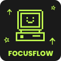

<div align="center">
  
</div>

<div align="justify" style="padding: 10px">
  <b>FocusFlow</b> is a cross-platform productivity application built with Flutter and integrated with Firebase. It helps users enhance focus, track distractions, monitor moods and receive personalized recommendations from AI and human coaches. The system also leverages the Gemini API to power intelligent insights, generate adaptive focus tips and analyze user productivity patterns, making the experience more personalized and data-driven.
</div>

---

# 📦 Project Structure
```
FocusFlow/
├── .dart_tool/
├── .idea/
├── android/
├── ios/
├── assets/
│   ├── icons/
│   └── images/
├── lib/
│   ├── models/
│   ├── providers/
│   ├── routes/
│   ├── screens/
│   │   ├── auth/
│   │   ├── user/
│   │   ├── coach/
│   │   └── admin/
│   ├── services/
│   ├── utils/
│   ├── widgets/
│   ├── app.dart
│   └── main.dart
├── linux/
├── macos/
├── test/
├── web/
├── windows/
├── .gitignore
├── pubspec.yaml
└── README.md
```

# 📁 Folder Overview
| Folder        | Description                                                                 |
|----------------|------------------------------------------------------------------------------|
| `models/`      | Defines app data structures (e.g., `User`, `FocusSession`, `Mood`)           |
| `providers/`   | Manages application state and logic using `ChangeNotifier`                    |
| `routes/`      | Handles route definitions and navigation logic                               |
| `screens/`     | Contains all UI screens grouped by role or feature (`auth`, `user`, `coach`, `admin`)  |
| `services/`    | Contains integrations for Firebase, AI and notifications                    |
| `utils/`       | Stores constants, helper functions, and theme configurations                 |
| `widgets/`     | Reusable UI components shared across multiple screens                        |

# ⚠️ Git Notes
- Some folders currently contains a `.gitkeep` file to ensure it's tracked in the repository

- You need to **create your own `.env` file** for environment variables
  a. The `.env` will **not be tracked by Git** for security reasons (it's listed in `.gitignore`)

# 🧩 Barrel Files
Each subfolder contains a **folder_name.dart** file that acts as a *barrel file*

So instead of importing multiple files like this:
```dart
import 'package:focusflow/models/user_model.dart';
import 'package:focusflow/models/focus_session_model.dart';
```

You can simply import the barrel file:
```dart
import 'package:focusflow/models/models.dart';
```

Now you have access to all related models or utilities within that folder

# 🚀 Getting Started
1. Clone the repository and change your directory to focusflow
```bash
git clone https://github.com/sevenpluseight/focusflow.git
cd focusflow
```
2. Install dependencies
```bash
flutter pub get
```
3. Run the app
```bash
flutter run
```

## 🔀 Git Workflow
Before you start working, make sure you are in your own branch:
```bash
# Available branches

git checkout wei-ling
git checkout pei-ying
git checkout pik-rou
```

Always pull the latest updates from the `main` branch before starting work:
```bash
git pull origin main
```

After committing your work, push your updates to **your own branch**
```bash
git push origin <your-branch-name>
```

### ✅ Best Practices
- Write clear and concise commit messages (e.g., add focus timer UI)
- Push your changes after completing a feature for smooth collaboration
- Once your work is ready, inform the group so it can be merged into `main`
- Always **sync (pull) before pushing** to avoid merge conflicts
